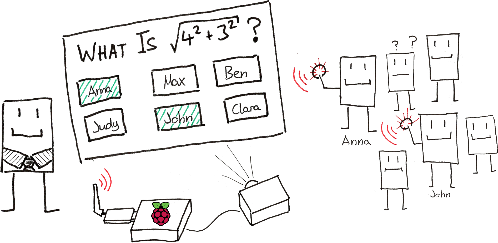

# Clickr
[](https://travis-ci.com/ftes/clickr-rails)
[](https://codeclimate.com/github/ftes/clickr-rails/maintainability)
[](https://codeclimate.com/github/ftes/clickr-rails/test_coverage)
[](https://www.gnu.org/licenses/gpl-3.0)

**Designed to motivate: A student response system for schools.**

[**Live Demo**](https://clickr.ftes.de) (credentials: `f@ftes.de` / `password`).



<!-- TODO Add intro screencast -->

**For teachers:**
- Give oral grades based on the response data, rather than a gut feeling.
- Spend no more taking notes on student participation after or during each lesson. 

**For students:**
- See how your participation immediately improves your oral grade.


## Features
<!-- TODO Link to screencasts/screenshots -->
- **Class and seating plan management:** Visual drag and drop editor.
- **Question mode:** Teacher opens question response timebox, students can respond by clicking.
- **Special merits:** Bump the student grade after outstanding responses.
- **Lesson Evaluation:** Interactive grading, based on response average.
- **Student grades:** Calculate overall grade based on responses in lessons.
- _Coming soon: Class list import (excel, csv)._
- _Coming soon: Student photo support._
- _Coming soon: "Name the student" - Learning mode for teacher using student photos._


## Tech Stack
- **Web app:** Ruby on Rails, PostgreSQL
- **Zigbee input adapter:** Node.js, [zigbee-herdsman](https://github.com/Koenkk/zigbee-herdsman)
- **CI/CD:** TravisCI, heroku (cloud preview) [balena.io](https://www.balena.io/) (embedded device management)


## Getting started (clickr/web development)
1. `cd services/web`
2. `bundle install`
3. `bundle exec rails db:create db:migrate db:seed`
4. `rails s`
5. `xdg-open http://localhost:3000` (credentials: `f@ftes.de`/`password`)


## Repository layout
<!-- $ tree -L 2 --filelimit 20 -d -->
```
├── bin
├── docs
│   └── adr
└── services
    ├── web
    └── zstack-zigbee-reader
```


## Further topics
- [Running in production](./docs/running-in-production.md)
- [Configuration](./docs/configuration.md)
- [Architectural decision](./docs/adr)
- [Docker build](./docs/docker-build.md)
- [Heroku demo](./docs/heroku.md)
